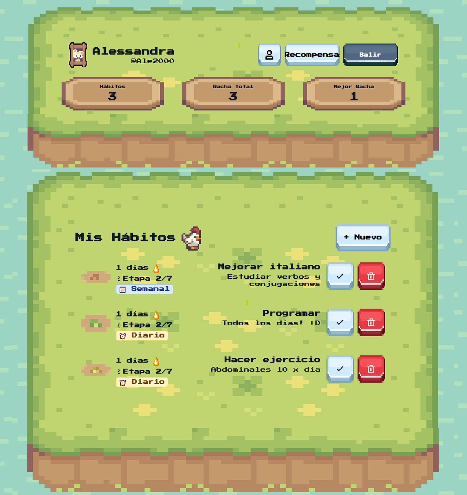
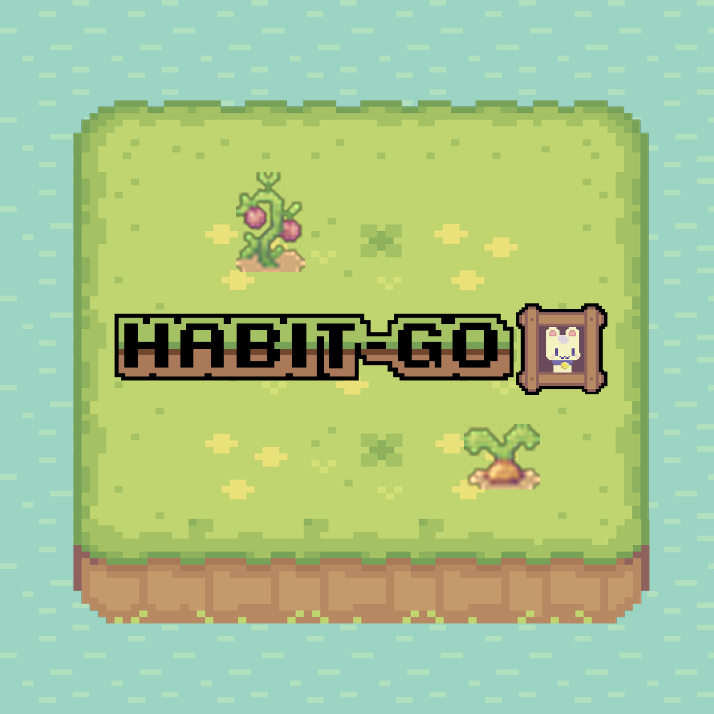
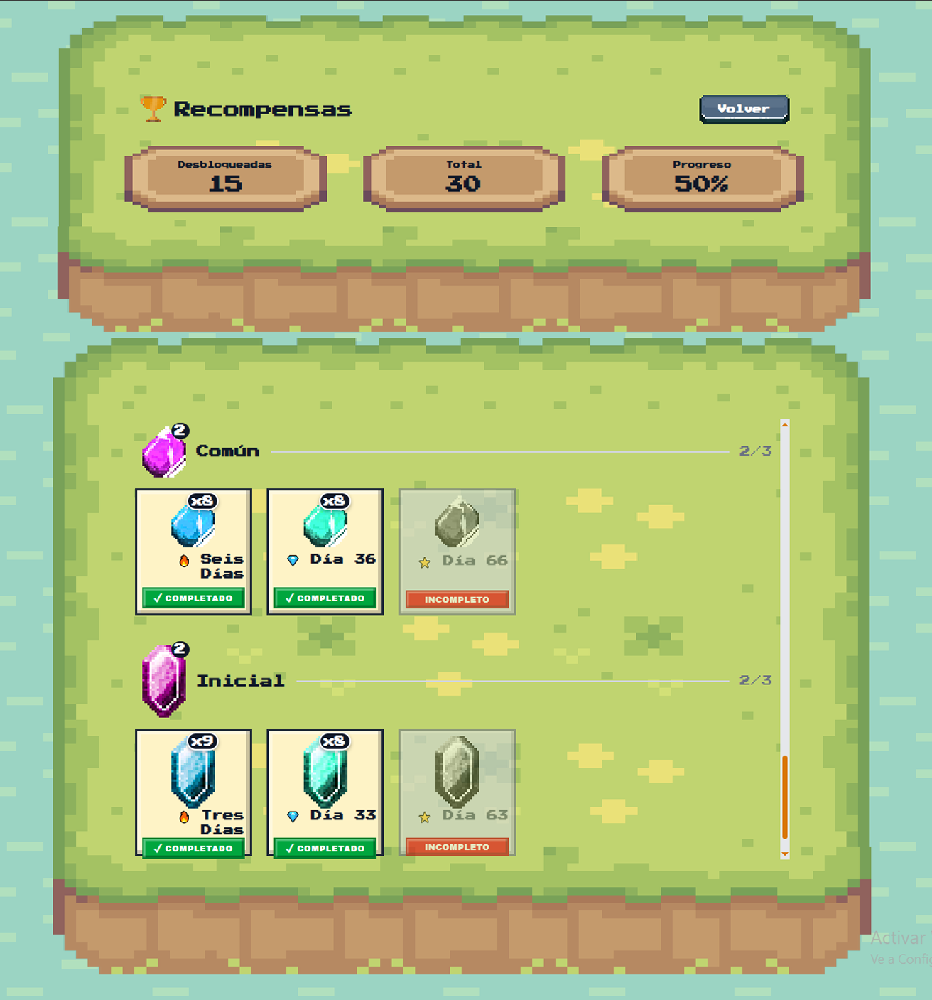

# Habit-GO Frontend 🚀

Aplicación web dedicada a gestionar y motivar el cumplimiento de hábitos diarios a través de un sistema de recompensas gamificado.

## 🛠️ Tecnologías utilizadas

<div style="text-align: center; padding: 20px;">
  
  
  
  
  
  
  
  
  
</div>

## 📸 Screenshots

<div align="center">
  
    
  
</div>

## Problema que se Intenta Resolver 🎯

**Para los Usuarios:**
- La dificultad de mantener la consistencia en nuevos hábitos sin seguimiento visual
- Falta de motivación externa que refuerce el comportamiento deseado

**Desafíos Técnicos:**
- Sincronización en tiempo real entre dispositivos (desktop y mobile)
- Gestión de datos complejos (hábitos, registros diarios, rachas)
- Interfaz intuitiva que funcione en cualquier dispositivo

## Solución Propuesta 💡

**Gestión Inteligente de Hábitos:**
- Crear y personalizar hábitos con objetivos específicos
- Seguimiento diario con confirmación de completación
- Sistema automático de rachas que incentiva la consistencia

**Gamificación y Recompensas:**
- Desbloquea recompensas virtuales al alcanzar milestones
- Sistema de puntos basado en rachas y consistencia
- Visualización de progreso mediante plantas virtuales que crecen

**Experiencia Multiplataforma:**
- Diseño responsive que funciona en desktop y mobile
- Sincronización automática entre dispositivos
- Interfaz pixel-art

**Autenticación Segura:**
- Login tradicional con email y contraseña
- Integración con Google OAuth para acceso rápido
- Gestión segura de sesiones con JWT

## ✨ Características Principales

- **Autenticación JWT** - Login/Register seguro con Google OAuth
- **Gestión de Hábitos** - Crear, editar, eliminar y completar hábitos
- **Sistema de Recompensas** - Desbloquea recompensas al alcanzar objetivos
- **Racha Diaria** - Mantén tu racha y aumenta tu motivación
- **Responsive Design** - Funciona en desktop y mobile con dual-render pattern
- **Pixel Art UI** - Diseño retro y personalizado


## 📋 Requisitos Previos

- Node.js 18+
- npm o yarn
- Backend ejecutándose en `http://localhost:3001`

## 🚀 Instalación

1. **Clonar el repositorio**
```bash
git clone <repo-url>
cd habit-go-frontend
```

2. **Instalar dependencias**
```bash
npm install
```

3. **Variables de entorno**
Crea un archivo `.env.local` en la raíz:
```env
NEXT_PUBLIC_API_BASE_URL=http://localhost:3001
```

4. **Ejecutar en desarrollo**
```bash
npm run dev
```

La app estará disponible en `http://localhost:3000`

## 📁 Estructura del Proyecto

```
habit-go-frontend/
├── app/                      # Páginas y rutas (Next.js app router)
│   ├── auth/                # Rutas de autenticación
│   │   ├── login/
│   │   ├── register/
│   │   └── forgot-password/
│   ├── dashboard/           # Dashboard principal
│   ├── habits/              # Gestión de hábitos
│   ├── profile/             # Perfil del usuario
│   ├── rewards/             # Página de recompensas
│   └── layout.tsx           # Layout raíz
├── components/              # Componentes React
│   ├── features/            # Componentes de negocio
│   │   └── Auth/            # Formularios de autenticación
│   ├── layouts/             # Layouts (AuthLayout, etc)
│   └── ui/                  # Componentes UI reutilizables
│       ├── Button/          # Botones (SpriteButton, SmallButton)
│       ├── Card/            # Tarjetas (PixelCard, HeaderCard, etc)
│       ├── Form/            # Elementos de formulario
│       ├── Input/           # Inputs (PixelInput)
│       ├── Modal/           # Modales
│       ├── Text/            # Componentes de texto
│       └── Icons/           # Iconos
├── hooks/                   # Custom React hooks
│   └── useAuth.ts          # Hook de autenticación
├── lib/                     # Utilidades y servicios
│   ├── api/                # Servicios de API
│   │   ├── authService.ts  # Login/Register
│   │   ├── habitsService.ts
│   │   └── ...
│   ├── apiClient.ts        # Cliente Axios configurado
│   ├── auth.ts             # Utilidades de autenticación
│   ├── constants.ts        # Constantes de la app
│   └── index.ts
├── public/                  # Archivos estáticos
│   ├── logo/               # Logos y marcos
│   ├── card/               # Imágenes de tarjetas
│   ├── button/             # Iconos de botones
│   ├── rewards/            # Iconos de recompensas
│   ├── readme/             # Imágenes para documentación
│   └── ...
├── styles/                  # Estilos globales
│   └── themes.css          # Temas y variables CSS
├── types/                   # Tipos TypeScript
│   └── api.ts              # Tipos de API
├── package.json
├── tsconfig.json
├── next.config.ts
├── tailwind.config.ts
└── README.md
```

### Autenticación
- **Login**: Envía email/contraseña al backend
- **JWT Response**: Backend devuelve `accessToken` y `userData`
- **Storage**: Se guardan en localStorage
- **Interceptor**: Axios agrega automáticamente el token en headers

### Componentes Principales

#### Pages
- **Login** (`/app/login/page.tsx`) - Formulario de inicio de sesión
- **Register** (`/app/register/page.tsx`) - Formulario de registro
- **Dashboard** (`/app/dashboard/page.tsx`) - Panel principal con hábitos
- **Profile** (`/app/profile/page.tsx`) - Perfil del usuario
- **Rewards** (`/app/rewards/page.tsx`) - Recompensas desbloqueadas


## 📝 Notas Importantes

1. **CORS**: El backend debe tener CORS habilitado para `http://localhost:3000`
2. **JWT Secret**: Debe coincidir entre frontend y backend
3. **localStorage**: Se usa para persistir la sesión del usuario
4. **Responsive**: Siempre testear en mobile y desktop


## 🚢 Deploy

Para producción:
```bash
npm run build
npm start
```

Variables de entorno necesarias:
```env
NEXT_PUBLIC_API_BASE_URL=https://api.tudominio.com
```

## 🤝 Contribuciones

Las contribuciones son bienvenidas. Por favor:
1. Fork el proyecto
2. Crea una rama para tu feature
3. Commit tus cambios
4. Push a la rama
5. Abre un Pull Request


**Creado con ❤️ usando Next.js y Tailwind CSS**
